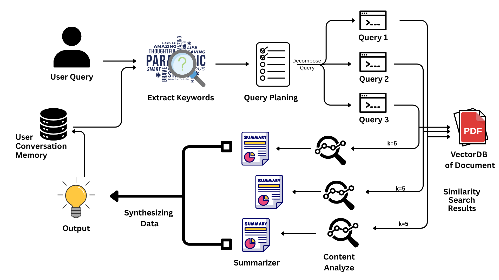

## Finance Brain

This project implements a memory-augmented, query-planning research assistant on top of LlamaIndex workflows and a Streamlit UI. It is designed to show clear separation of concerns (memory, retrieval, tools, workflow, UI) and to match the assignment requirements around short/long-term memory, query decomposition, tools, and rate limiting.

## Project Overview

-The assistant is a document-focused RAG system (e.g., for `adobe-annual-report.pdf`) that can:

## System Flowchart

Below is a high-level flowchart of the FinanceBrain system:



---

- Remember facts across turns (short- and long-term memory).
- Decompose complex questions into sub-questions.
- Retrieve and summarize relevant context from a vector store.
- Analyze content (themes, sentiment, entities, structure).
- Respect LLM API rate limits via a central router.
- Provide an interactive Streamlit chat UI.

The codebase is structured so each concern (LLM, embeddings, memory, retrieval, tools, workflow, UI) is modular and replaceable.

***

## Directory Structure

A typical layout:

```bash
FinanceBrain/
├── app.py                   # Streamlit UI (chat interface)
├── src/
│   ├── config/
│   │   └── settings.py      # Config: API keys, models, paths, limits
│   ├── llm/
│   │   ├── models.py        # Groq LLM + embedding model factory
│   │   └── rate_limiter.py  # Central async rate limiter
│   ├── memory/
│   │   ├── memory_loader.py # Chroma-backed vector store for memory
│   │   └── memory_manager.py # Short + long term memory manager
│   ├── loader/
│   │   └── document_loader.py # Loads PDFs, builds VectorStoreIndex
│   ├── tools/
│   │   ├── keyword_extracter.py
│   │   ├── summarizer.py
│   │   └── content_analyzer.py
│   ├── retrieval/
│   │   ├── retriever.py     # Query-time retrieval from doc index
│   │   └── subquery.py      # Query decomposition & synthesis helpers
│   ├── workflow/
│   │   ├── events.py
│   │   └── research_workflow.py
│   └── utils/
│       └── logger.py
├── data/
│   └── documents/
│       └── adobe-annual-report.pdf
├── VectorDB/
│   ├── chroma_db/
│   └── MemoryBase/
```

You can adjust names, but this structure makes it easy to understand where things live.

***

## Configuration (`src/config/settings.py`)

`Settings` is a simple config holder to keep magic constants and secrets out of the code:

- **API keys**: `GROQ_API_KEY`, `GOOGLE_API_KEY` (or whatever you use).
- **Models**:
  - `LLM_MODEL` for the chat/completion model (e.g., `llama3-70b-8192`).
  - `EMBEDDING_MODEL` for vector embeddings (e.g., `BAAI/bge-small-en-v1.5` or `models/text-embedding-004`).
- **Paths**:
  - `VECTOR_DB_PATH` – persistent Chroma DB for documents.
  - `MEMORY_DB_PATH` – persistent Chroma DB for long-term memory.
  - `DOCUMENTS_PATH` – folder with PDFs (e.g., `adobe-annual-report.pdf`).
- **Performance & memory**:
  - `MEMORY_TOKEN_LIMIT` – how many tokens are kept in short-term chat memory.
  - `MAX_FACTS` – how many extracted facts to keep in long-term memory.
  - `SIMILARITY_TOP_K` – how many nodes to retrieve from vector store.
  - `MAX_REQUESTS_PER_MINUTE` – rate limiting budget per minute.
  - `WORKFLOW_TIMEOUT` – max seconds for a workflow run.

Everything is read from `.env` so you can easily change behavior between dev / demo / production without code changes.

***

## LLM & Embeddings Layer (`src/llm/`)

### `models.py`

This module centralizes LLM and embedding model initialization.

- `get_llm()` returns a singleton LLM instance (e.g., Groq’s `llama3-70b-8192`).
- `get_embed_model()` returns a singleton embedding model (e.g., HuggingFace or Google embedding).

Why centralize?
- Ensures only one instance of each is created and reused.
- Keeps API keys and model names in one place (`settings`).
- Makes it easy to mock models in tests.

### `rate_limiter.py`

Implements an async rate limiter:

- Tracks timestamps of recent LLM calls.
- If more than `MAX_REQUESTS_PER_MINUTE` are attempted in the last 60 seconds, it sleeps before allowing new calls.
- Exposes `call_with_limit(func, *args, **kwargs)`:
  - Wraps any LLM call (`llm.acomplete`, `llm.complete`, synthesis calls, etc.).
  - All tools and workflow steps use this wrapper for API calls.

This ensures:
- You don’t exceed API quotas.
- You can tune throughput with a single config.

***

## Memory System (`src/memory/`)

### `memory_loader.py`

- Wraps Chroma’s `PersistentClient` to manage a dedicated collection for **memory**.
- Creates or loads a collection at `MEMORY_DB_PATH`.
- Returns a `ChromaVectorStore` suitable for LlamaIndex `VectorMemoryBlock`.

This isolates vector-store setup from the rest of the memory logic.

### `memory_manager.py`

Implements **both** short-term and long-term memory:

- Uses `Memory.from_defaults` from LlamaIndex with:
  - A **token-limited sliding window** for short-term chat history.
  - Custom memory blocks for long-term memory:
    - `FactExtractionMemoryBlock`:
      - Uses the LLM to automatically pull out important facts from the conversation and store them as structured entries.
    - `VectorMemoryBlock`:
      - Stores memories in a vector store (Chroma) so they can be semantically retrieved later.

Responsibilities:
- Initialize the memory with proper blocks.
- Provide `get_memory()` to access the underlying `Memory` object.
- Provide `get_context()` to fetch the current memory context (for debugging, or to include as additional context in prompts).
- In the workflow, final user/assistant messages are written to memory as `ChatMessage` objects, which triggers fact extraction and long-term storage.

This satisfies the assignment’s requirement for:
- Short-term memory (per-session context).
- Long-term memory (learned facts reused in future sessions).

***

## Document Loading & Indexing (`src/loader/document_loader.py`)

`DocumentLoader` is responsible for converting raw files into an index:

- Uses `SimpleDirectoryReader` + `PyMuPDFReader` to load `.pdf` files from `DOCUMENTS_PATH`.
- Uses Chroma as the vector store for **document** embeddings.
- On first run:
  - Reads all PDFs into `Document` objects.
  - Builds a `VectorStoreIndex` with the chosen `embed_model`.
- On subsequent runs:
  - Reuses the existing Chroma collection and constructs a `VectorStoreIndex` from the vector store, avoiding recomputing embeddings.

The resulting `VectorStoreIndex` is used for retrieval during the workflow.

***

## Tools Layer (`src/tools/`)

These are reusable, composable utilities the workflow calls. Each tool is independent and can be swapped or extended.

### Keyword Extractor (`keyword_extracter.py`)

- Wraps LlamaIndex’s `KeywordExtractor` with:
  - Custom prompt: “Return ONLY a comma-separated list of keywords…”
  - Configurable `max_keywords`.
- Input: a string (`text`).
- Output: `List[str]` of cleaned keywords.
- Used at the beginning of the workflow to:
  - Enhance retrieval.
  - Optionally feed into memory or analytics.

### Summarizer (`summarizer.py`)

Provides **multiple summarization strategies**:

- `tree_summarize(text, query=...)`
  - Uses `TreeSummarize` response synthesizer for hierarchical summarization.
  - Good for very long contexts or documents.
- `extractive_summary(text, num_sentences=N)`
  - Identifies key sentences, often by prompting the LLM to pick the N most important ones.
- `abstractive_summary(text, max_words=...)`
  - Short, LLM-generated summaries with a word budget.
- `summarize_with_bullets(text, num_points=N)`
  - Returns a list of bullet-point summaries.
- `auto_summarize(text, target_length="short|medium|long")`
  - Chooses strategy based on the length of the input text:
    - Short text → extractive.
    - Medium → abstractive.
    - Long → tree summarization.

The workflow uses `auto_summarize` to **compress retrieved contexts** before final synthesis, reducing token usage while keeping important details.

### Content Analyzer (`content_analyzer.py`)

A higher-level tool for document/query analysis:

- `extract_themes(text, num_themes=5)`
  - Finds main themes + short descriptions.
- `analyze_sentiment(text)`
  - Returns overall sentiment, confidence, reasoning.
- `extract_entities(text)`
  - Extracts people, organizations, locations, dates, and key numbers.
- `analyze_structure(text)`
  - Estimates document type, style, key sections, and basic stats (word count, sentences, etc.).
- `comprehensive_analysis(text)`
  - Runs all of the above and combines the results into a structured report.

In the workflow, you can:
- Use sentiment on the query to adapt tone.
- Use theme/entity analysis to enrich answers or for debugging.

### Retriever (`tools/retriever.py`)

- Wraps `VectorStoreIndex.as_retriever` into a simple class.
- `retrieve(query)`: returns a list of `NodeWithScore` for the top-k similar nodes.
- `get_text_from_nodes(nodes)`: concatenates node text for further processing (summarization / synthesis).

This is separated from `retrieval/subquery.py` so the same tool can be reused in other workflows or components.

***

## Retrieval & Query Planning (`src/retrieval/`)

### `retriever.py` (document retrieval)

Thin convenience wrapper to keep retrieval concerns local.

### `subquery.py` (query planning & synthesis)

Responsible for query decomposition and multi-step retrieval logic:

- `create_sub_queries(query)`:
  - Calls the LLM with a “decompose into sub-questions” prompt.
  - Parses numbered output (e.g., “1. … 2. …”) into a list of sub-queries.
- `retrieve_for_sub_queries(sub_queries)`:
  - For each sub-query, uses the document retriever to fetch relevant nodes.
  - Returns a list of `(sub_query, context_text)` tuples.
- `synthesize_final_answer(original_query, sub_queries_and_contexts)`:
  - Builds a prompt that includes:
    - Original question.
    - Each sub-question with its summarized context.
  - Calls the LLM once to generate a coherent final answer.

This module isolates the logic for:
- Query planning & decomposition.
- Orchestrating multi-step retrieval.
- Final answer synthesis.

***

## Workflow Orchestration (`src/workflow/`)

### Events (`events.py`)

Defines strongly-typed events that travel between workflow steps:

- `QueryEvent` – carries the original query plus metadata (keywords, sentiment).
- `SubQueriesEvent` – holds the list of sub-queries and the original query.
- `RetrievalEvent` – holds sub-queries paired with their (possibly summarized) contexts.
- `SynthesisEvent` – carries the final answer and sub-queries list.

This makes the workflow’s data flow explicit and easy to follow.

### Research Workflow (`research_workflow.py`)

This is the **heart of the system**: a LlamaIndex `Workflow` that wires together memory, tools, and retrieval into a coherent pipeline.

Recommended flow:

1. **`analyze_query` (StartEvent → QueryEvent)**  
   - Input: raw query (from StartEvent).
   - Actions:
     - Extract keywords (keyword tool).
     - Analyze sentiment (content analyzer).
     - Optionally consult memory context (memory manager).
   - Output: `QueryEvent(query, keywords, sentiment)`.

2. **`decompose_query` (QueryEvent → SubQueriesEvent)**  
   - Uses `SubqueriesOperations.create_sub_queries`.
   - Breaks a complex question into smaller ones.
   - Output: `SubQueriesEvent(sub_queries, original_query, keywords)`.

3. **`retrieve_contexts` (SubQueriesEvent → RetrievalEvent)**  
   - Uses `SubqueriesOperations.retrieve_for_sub_queries`.
   - For each sub-query, retrieves relevant document text.
   - Output: `RetrievalEvent(original_query, sub_queries_and_contexts, keywords)`.

4. **`summarize_contexts` (RetrievalEvent → RetrievalEvent)**  
   - For each `(sub_query, raw_context)`:
     - Calls summarizer’s `auto_summarize` to compress the context.
   - Replaces long contexts with short summaries.
   - Output: updated `RetrievalEvent` with summarized contexts.

5. **`synthesize_answer` (RetrievalEvent → SynthesisEvent)**  
   - Calls `SubqueriesOperations.synthesize_final_answer`.
   - Produces a final, coherent answer that references all sub-questions.
   - Output: `SynthesisEvent(original_query, answer, sub_queries, keywords)`.

6. **`store_and_return` (SynthesisEvent → StopEvent)**  
   - Writes user question and answer into memory as `ChatMessage`s.
     - Short-term: for immediate context.
     - Long-term: via fact extraction & vector memory.
   - Returns a `StopEvent` with a result dict:
     - `answer`
     - `sub_queries`
     - `original_query`
     - `keywords`
     - (optionally) sentiment or extra metadata.

The workflow thus satisfies:
- **Memory system**: short + long-term.
- **Query planning**: explicit decomposition step.
- **Tool usage**: keyword, summarization, analysis integrated at appropriate stages.
- **Rate limiting**: all LLM calls go through the rate-limiting wrapper.

***

## Streamlit UI (`app.py`)

The UI turns everything into an interactive chat experience.

Key elements:

- **Session state**:
  - `messages`: list of `{role, content, ...}` for chat history.
  - `index`: cached `VectorStoreIndex` (documents).
  - `memory_manager`: per-session `MemoryManager`.
- **Chat interface**:
  - Uses `st.chat_message("user"/"assistant")` to render chat bubbles.
  - `st.chat_input(...)` for user input.
- **Workflow execution**:
  - When a user submits a query:
    - The app appends it to `messages`.
    - Shows a spinner while running `workflow.run(query=...)`.
    - Displays the final answer.
    - Optionally shows:
      - Extracted sub-queries in an expander.
      - Keywords or other metadata.
- **Caching**:
  - Uses `st.cache_resource` (or similar) to:
    - Avoid re-building the document index on each request.
    - Optionally reuse a single workflow per process.

This provides a user-friendly front-end for your agent and is easy to extend (add analytics page, settings page, etc.).

## 🐳 Docker Deployment

### Prerequisites

- **Docker Desktop** (Windows/Mac) or **Docker Engine** (Linux)
- **Docker Compose** v2.0+
- **2GB+ free disk space**
- API Keys:
  - Groq API Key: [console.groq.com](https://console.groq.com)
  - Google Generative AI Key: [aistudio.google.com](https://aistudio.google.com/app/apikey)

---

### Quick Start with Docker

#### 1. Clone Repository

```
git clone https://github.com/harshpimpale/FinanceBrain
cd FinanceBrain
```

**Note**: The `data/documents/adobe-annual-report.pdf` is already included in the repository.

#### 2. Environment Setup

```
# Create .env file from example
cp .env.example .env

# Edit with your API keys
nano .env  # or use any text editor (notepad, vim, etc.)
```

Your `.env` should look like:
```
API_KEY=your_groq_api_key_here
GOOGLE_API_KEY=your_google_api_key_here
GROQ_MODEL= openai/gpt-oss-20b
EMBEDDING_MODEL=models/text-embedding-004
MAX_REQUESTS_PER_MINUTE=30
LOG_LEVEL=INFO
```

#### 3. Build and Run

```
# Build the Docker image (takes 3-5 minutes first time)
docker-compose build

# Start application in background
docker-compose up -d

# View logs to confirm it's running
docker-compose logs -f financebrain
```

You should see:
```
financebrain-app  | You can now view your Streamlit app in your browser.
financebrain-app  | URL: http://0.0.0.0:8501
```

#### 4. Access Application

Open your browser and navigate to:
```
http://localhost:8501
```

**First Query Note**: The initial query may take 30-60 seconds as the system builds the vector index from the PDF. Subsequent queries will be much faster (8-15 seconds).

---

### Adding Your Own Documents (Optional)

If you want to use different PDFs:

```
# 1. Stop the application
docker-compose down

# 2. Replace or add PDFs in data/documents/
cp your-document.pdf data/documents/

# 3. Remove old vector database (to force re-indexing)
rm -rf VectorDB/chroma_db

# 4. Restart
docker-compose up -d
```

---

### Docker Commands Reference

#### Basic Operations

| Command | Purpose | Use Case |
|---------|---------|----------|
| `docker-compose build` | Build/rebuild image | After code changes or first setup |
| `docker-compose up -d` | Start in background | Normal production usage |
| `docker-compose up` | Start with logs visible | Development/debugging |
| `docker-compose down` | Stop containers | Shutdown application |
| `docker-compose restart` | Restart containers | After .env file changes |
| `docker-compose down -v` | Remove everything including volumes | Complete reset |

#### Monitoring & Debugging

```
# View real-time logs
docker-compose logs -f financebrain

# View last 100 log lines
docker-compose logs --tail=100 financebrain

# Check container status
docker-compose ps

# Monitor resource usage (CPU, Memory, Network)
docker stats financebrain-app

# Check health status
docker inspect financebrain-app --format='{{.State.Health.Status}}'

# Access container shell for debugging
docker exec -it financebrain-app /bin/bash

# Check if document is loaded
docker exec financebrain-app ls -la /app/data/documents

# View environment variables inside container
docker exec financebrain-app env

# Test application health endpoint
curl http://localhost:8501/_stcore/health
```

#### Maintenance & Updates

```
# Rebuild after code changes
docker-compose down
docker-compose up --build

# Full rebuild (no cache) - use if changes not reflecting
docker-compose build --no-cache
docker-compose up -d

# View detailed build process
docker-compose build --progress=plain

# Check Docker image size
docker images | grep financebrain
```

#### Cleanup Operations

```
# Remove stopped containers
docker container prune

# Remove unused images
docker image prune

# Remove unused volumes (⚠️ deletes vector databases)
docker volume prune

# Clean everything (use with caution!)
docker system prune -a

# Remove specific FinanceBrain image
docker rmi financebrain-financebrain:latest
```

---

### Troubleshooting Docker Issues

#### Issue 1: Port Already in Use

**Error**: `Bind for 0.0.0.0:8501 failed: port is already allocated`

**Solution**:
```
# Windows - Find process using port 8501
netstat -ano | findstr :8501
taskkill /PID <PID> /F

# Linux/Mac - Find and kill process
lsof -i :8501
kill -9 <PID>

# Alternative: Change port in docker-compose.yml
ports:
  - "8502:8501"  # Use port 8502 instead, access via http://localhost:8502
```

#### Issue 2: Missing API Keys

**Error**: `ValueError: API_KEY not found in environment`

**Solution**:
```
# Check if .env file exists
ls -la .env

# If missing, create from example
cp .env.example .env

# Edit and add your actual API keys
nano .env

# Restart container
docker-compose restart
```

#### Issue 3: Container Exits Immediately

**Solution**:
```
# Check logs for error details
docker-compose logs financebrain

# Common fixes:
# 1. Missing .env file
cp .env.example .env  # Then add your keys

# 2. Invalid API keys
# Verify keys work at console.groq.com and aistudio.google.com

# 3. Dependencies issue
docker-compose build --no-cache
```

#### Issue 4: Application Not Loading (Blank Screen)

**Solution**:
```
# Check if Streamlit is running
docker-compose logs financebrain | grep "You can now view"

# Check if port is accessible
curl http://localhost:8501

# Try accessing with explicit IP
http://127.0.0.1:8501

# Check browser console for errors (F12 in Chrome/Firefox)

# Restart with fresh logs
docker-compose down
docker-compose up
```

#### Issue 5: "Document Not Found" Error

**Solution**:
```
# Verify PDF is in repository
ls -la data/documents/adobe-annual-report.pdf

# If missing, re-clone repository or download PDF manually

# Check inside container
docker exec financebrain-app ls -la /app/data/documents

# If volume mount is wrong, fix docker-compose.yml:
volumes:
  - ./data/documents:/app/data/documents  # Must match your folder structure
```

#### Issue 6: Memory/Performance Issues

**Solution**:
```
# Check Docker resource allocation
docker stats

# Increase Docker Desktop memory:
# Docker Desktop → Settings → Resources → Memory → Set to 4GB+

# Check disk space
docker system df

# Clear old images/containers
docker system prune
```

---

### Docker Configuration Details

#### Environment Variables

The application uses these environment variables (set in `.env`):

| Variable | Description | Default | Required |
|----------|-------------|---------|----------|
| `API_KEY` | Groq API key for LLM | - | ✅ Yes |
| `GOOGLE_API_KEY` | Google Generative AI key | - | ✅ Yes |
| `GROQ_MODEL` | LLM model name | `llama-3.1-8b-instant` | No |
| `EMBEDDING_MODEL` | Embedding model | `models/text-embedding-004` | No |
| `MAX_REQUESTS_PER_MINUTE` | Rate limit for API calls | `30` | No |
| `LOG_LEVEL` | Logging verbosity | `INFO` | No |

#### Volumes & Persistence

The Docker setup mounts these volumes for data persistence:

```
volumes:
  - ./VectorDB:/app/VectorDB              # Document & memory embeddings
  - ./data/documents:/app/data/documents  # PDF files (from GitHub)
```

**What this means:**
- ✅ Vector databases persist between container restarts
- ✅ You can add new PDFs without rebuilding the image
- ✅ Memory (conversation history) is preserved across sessions
- ✅ The PDF from GitHub is automatically mounted
- ❌ Deleting `VectorDB/` folder will require re-indexing (takes 30-60 seconds)

#### Networking

- **Port Mapping**: `8501:8501` (host:container)
- **Network**: Bridge network `financebrain-network`
- **Access URLs**: 
  - `http://localhost:8501`
  - `http://127.0.0.1:8501`

---

### Testing Inside Docker

#### Run Tests in Container

```
# Start container
docker-compose up -d

# Run all tests
docker exec financebrain-app pytest tests/ -v

# Run specific test file
docker exec financebrain-app pytest tests/test_memory.py -v

# Run with coverage report
docker exec financebrain-app pytest tests/ --cov=src --cov-report=html
```

#### Manual Testing

```
# Access Python shell inside container
docker exec -it financebrain-app python

# Test imports
>>> from src.llm.models import get_llm
>>> llm = get_llm()
>>> print(llm)

# Test document loading
>>> from src.loader.document_loader import DocumentLoader
>>> loader = DocumentLoader()
>>> index = loader.load_documents()
>>> print(f"Documents loaded: {index}")
```

---

### Performance Metrics (Dockerized)

| Metric | Value | Notes |
|--------|-------|-------|
| **Container Size** | ~1.2 GB | After build |
| **Build Time** | 3-5 min | First build (downloads dependencies) |
| **Rebuild Time** | 30-60 sec | Subsequent builds (cached layers) |
| **Startup Time** | 10-15 sec | Container initialization |
| **First Query** | 30-60 sec | Vector index creation from PDF |
| **Subsequent Queries** | 8-15 sec | Complex queries with decomposition |
| **Memory Usage** | 500MB-1GB | During active queries |
| **CPU Usage** | 10-30% | Idle to active workload |

---

### Repository Structure

Your GitHub repository includes:

```
FinanceBrain/
├── .env.example               # ✅ Included (template)
├── .dockerignore             # ✅ Included (build optimization)
├── docker-compose.yml        # ✅ Included (deployment config)
├── Dockerfile                # ✅ Included (image definition)
├── requirements.txt          # ✅ Included (Python dependencies)
├── README.md                 # ✅ This file
├── design_doc.pdf            # ✅ Architecture documentation
├── app.py                    # ✅ Streamlit UI
├── data/
│   └── documents/
│       └── adobe-annual-report.pdf  # ✅ Included in repo
├── src/                      # ✅ All source code included
└── tests/                    # ✅ Test files included
```

**NOT included in repo (generated at runtime):**
- `.env` - Contains your API keys (git ignored for security)
- `VectorDB/` - Generated vector databases (git ignored, too large)
- `__pycache__/` - Python cache files

---

### Complete Setup Example

From clone to running application:

```
# 1. Clone repository
git clone https://github.com/harshpimpale/FinanceBrain.git
cd FinanceBrain

# 2. Verify PDF is present
ls data/documents/adobe-annual-report.pdf

# 3. Setup environment
cp .env.example .env
nano .env  # Add your API keys

# 4. Build and start
docker-compose build
docker-compose up -d

# 5. Check logs
docker-compose logs -f financebrain

# 6. Access application
# Open http://localhost:8501 in browser

# 7. Test query
# Type: "Who is Adobe's CEO?"
```

---

### Summary

✅ **With Docker, you get:**
- Consistent environment across all machines
- No Python version conflicts
- Automatic dependency management
- One-command deployment
- Data persistence across restarts

✅ **Three-command setup:**
```
cp .env.example .env  # Add your API keys
docker-compose build
docker-compose up -d
```

✅ **Repository includes:**
- ✅ Sample PDF already included (`data/documents/adobe-annual-report.pdf`)
- ✅ Complete Docker configuration
- ✅ All source code and tests

For issues, check the [Troubleshooting](#troubleshooting-docker-issues) section above.